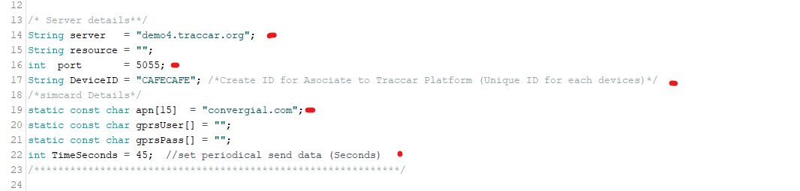
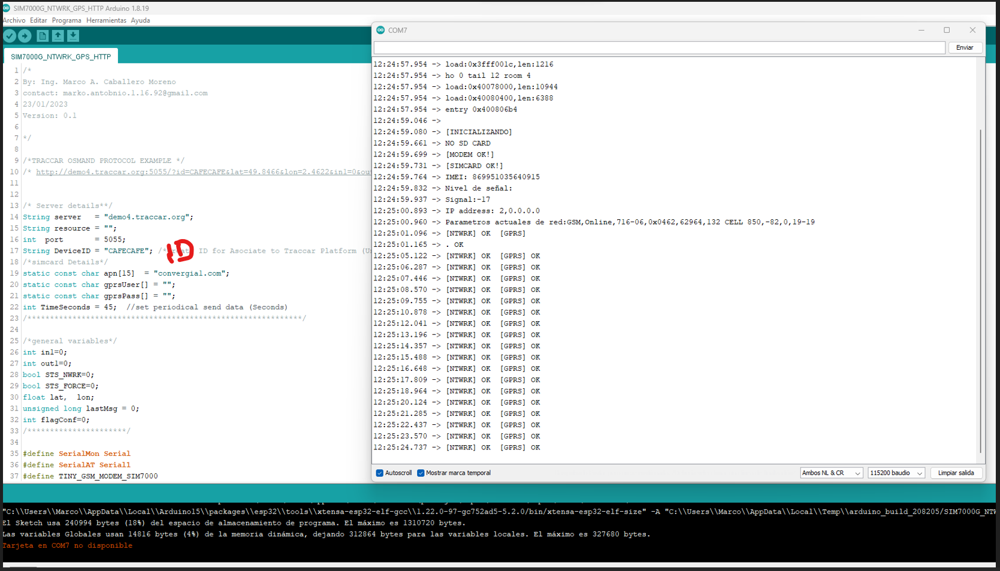
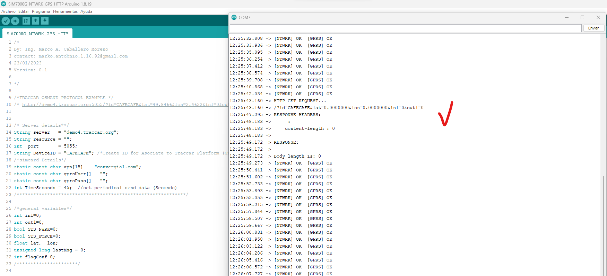

# TTGO-SIM7000G-TRACCAR
Guide to connect the lilygo TTGO SIM7000G to Traccar Platform (open source Tracking and position platfom for vehicles)

## 1. Introduction
This project consists of linking the popular LILYGO SIM7000G cards to the Traccar Platform. The 7000G Modem has GSM/GPRS NBIOT and LTEM communication, in addition to having an integrated GPS modem, which makes it a perfect solution to develop solutions that involve real-time geopositioning.
The language used is ARDUINO and I use the TINYGSM library https://github.com/vshymanskyy/TinyGSM/tree/master
The functionalities consist of the following:
- Sending geographical coordinates
- Remote reading of a digital Pin
- Remote writing to a Digital pin
- Configurable data sending frequency

*Note: The functionalities can extend to different conveniences such as reading RS485 sensors, reading analog channels, temperature sensors, humidity, etc.

The platform in charge of reception is TRACCAR, an open source platform for vehicle tracking and tracking. This platform is very well known and there is much more information on its official website https://www.traccar.org/.
To link the SIM7000G to Traccar I use the OSMAND protocol, which is basically using an HTTP GET REQUEST with parameters as described by the osmand protocol, more information here: https://www.traccar.org/osmand/

## 2. Programing 
- Inserts a SIMCARD with credit, verify that there is coverage from your operator. In my case I use this IoT M2M SIMCARD in Peru https://teca.pe/shop/plan-simcard-iot-m2m-20mb-mes-x-1ano-27#attr=
- Enter the correct traccar server data, in my case I use one of the free traccar test servers.
- At the beginning of the code it is advisable to enter the correct data of the SIMcard APN, username and password if applicable.

- Load the source code, it is an Arduino sketch called "SIM7000G_NTWRK_GPS_HTTP" to the devkit.
- Open the Arduino serial terminal to observe how it works.
 
- example for request successful

## 3. Configure Traccar
- Create an Account, in my case use https://demo4.traccar.org/
- Go to plus Simbol "+" is located at the top
- Add a new Device with alias and the device ID 
  
- Go to pop up and click in the edit simbol 
  
- In preferences, maps, add the option to receive input 1 and output 1, this option looks in the pop up.
  
  
- Example of successful connection to traccar:
 
- Send remote command of traccar to Sim7000g, click in the simbol:
 
- in the row data, write the command. "out1=1" or "out1=0" . The led blinks as the command indicates
  
- In the next request, the command is sending. this content looks there in  the therminal, and the led turn ON.
- 
